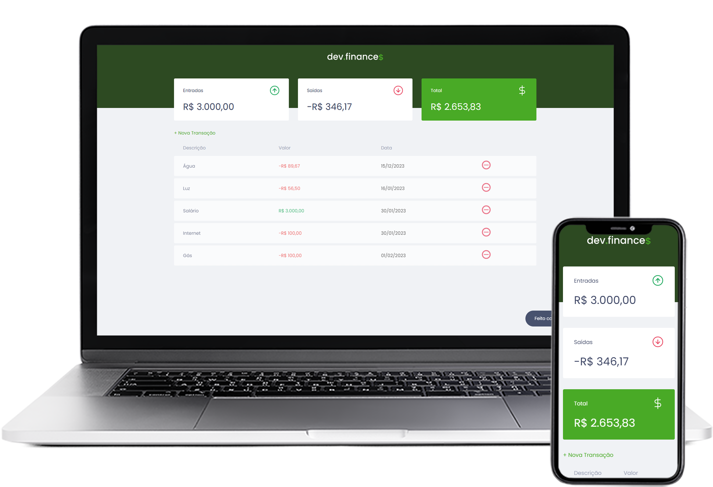

<h1 align="center">
  
</h1>

  <a href="#tecnologias">Tecnologias</a>&nbsp;&nbsp;&nbsp;|&nbsp;&nbsp;&nbsp;
  <a href="#projeto">Projeto</a>
  &nbsp;&nbsp;&nbsp;|&nbsp;&nbsp;&nbsp;
  <a href="#layout">Layout</a>
  &nbsp;&nbsp;&nbsp;|&nbsp;&nbsp;&nbsp;
  <a>Licença</a>

 

  

 

  

## :rocket: Tecnologias

Esse projeto foi desenvolvido com as seguintes tecnologias:

- [HTML](https://developer.mozilla.org/pt-BR/docs/Web/HTML)
- [CSS](https://developer.mozilla.org/pt-BR/docs/Web/CSS)
- [JavaScript](https://www.javascript.com/)

## :computer: Projeto

O dev.finances é uma aplicação de gestão financeira pessoal, onde é possível cadastrar e excluir transações fornencendo uma vizualização geral do balanço de contas.

Projeto realizado na Maratona Discover promovido pela <a href="https://github.com/Rocketseat">Rocketseat</a>.

## :art: Layout

Você pode visualizar através <a href="https://www.figma.com/file/7Vu9DzUaCZIV4nibzkjgB4/dev.finance-Maratona-Discover/duplicate">desse link</a>. É necessário ter uma conta no Figma para acessá-lo.

## :memo: Licença

Esse projeto está sob a licença MIT.

